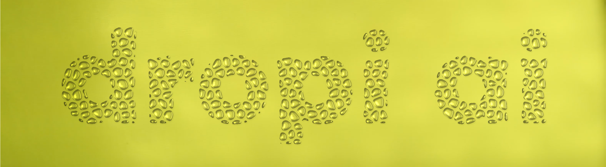
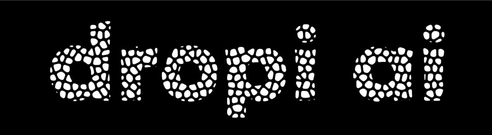

# dropiAI

Проект для бинарной сегментации и анализа капель ,как в видеопотоке, так и фотографий. 
В проекте реализовано два подхода: традиционный, с использованием методов компьютерного зрения, и с помощью нейросетевой модели U-Net.

## Структура проекта

- `traditional-segmentation/`: Директория с реализацией традиционного подхода.
  - `VideoFilter_and_DropletAnalyzer.py`: Скрипт для фильтрации видео, обнаружения и анализа капель.
- `unet-segmentation/`: Директория с реализацией подхода на основе U-Net.
  - `U_net_analiz.py`: Скрипт для анализа одиночных изображений с помощью U-Net.
  - `U_net_video_segmentation.py`: Скрипт для сегментации видео с помощью U-Net в реальном времени.
  - `Dataset/`: Датасет для обучения и тестирования модели U-Net.
  - `models/`: Директория для хранения обученных моделей.

## Традиционная сегментация

Скрипт `VideoFilter_and_DropletAnalyzer.py` использует классические алгоритмы компьютерного зрения для обнаружения и анализа капель.

### Возможности

- **Фильтрация видео в реальном времени**: Настройка параметров фильтрации (Canny, билатеральный фильтр) с помощью трекбаров OpenCV.
- **Обнаружение капель**: Поиск контуров и аппроксимация их эллипсами.
- **Анализ траекторий**: Отслеживание капель между кадрами и построение их траекторий.
- **Сохранение результатов**: Сохранение параметров эллипсов и траекторий в форматах JSON и AVI.

### Использование

1.  Измените путь к видеофайлу в `video_path` в конце скрипта.
2.  Запустите скрипт.
3.  Настройте параметры фильтрации в окне 'Properties'.
4.  Нажмите 'q', чтобы начать анализ всего видео с выбранными параметрами.

## Сегментация на основе U-Net

Этот подход использует нейросетевую модель U-Net для более точной семантической сегментации.

### `U_net_analiz.py`

Скрипт для анализа и сегментации одиночных изображений.

#### Возможности

- **Сегментация изображений**: Применение модели U-Net для получения маски сегментации.
- **Визуализация**: Отображение исходного изображения, маски и их наложения.
- **Анализ размеров капель**: Построение гистограммы распределения капель по радиусам.

#### Использование

1.  Укажите путь к весам модели в `model_path`.
2.  Укажите путь к изображению в `image_path`.
3.  Запустите скрипт.

### `U_net_video_segmentation.py`

Скрипт для сегментации видео в реальном времени.

#### Возможности

- **Сегментация видео в реальном времени**: Применение модели U-Net к каждому кадру видео.
- **Выбор ROI**: Возможность выбрать область интереса для обработки.
- **Интерактивное управление**: Пауза, навигация по кадрам, сохранение кадров.

#### Использование

1.  Укажите путь к весам модели в `model_path`.
2.  Укажите путь к видео в `video_path`.
3.  Запустите скрипт.
4.  Выделите ROI мышью и нажмите пробел.
5.  Используйте 'q' для выхода, пробел для паузы, 'f' и 'b' для перемотки.

## Датасет

Датасет находится в папке `unet-segmentation/Dataset` и разделен на обучающую и тестовую выборки. Аннотации для обучающей выборки находятся в `Trainannot`.

## Установка и зависимости

Для запуска проекта необходимы следующие библиотеки:

- `torch`
- `torchvision`
- `cv2` (OpenCV)
- `numpy`
- `matplotlib`
- `segmentation-models-pytorch`
- `scipy`
